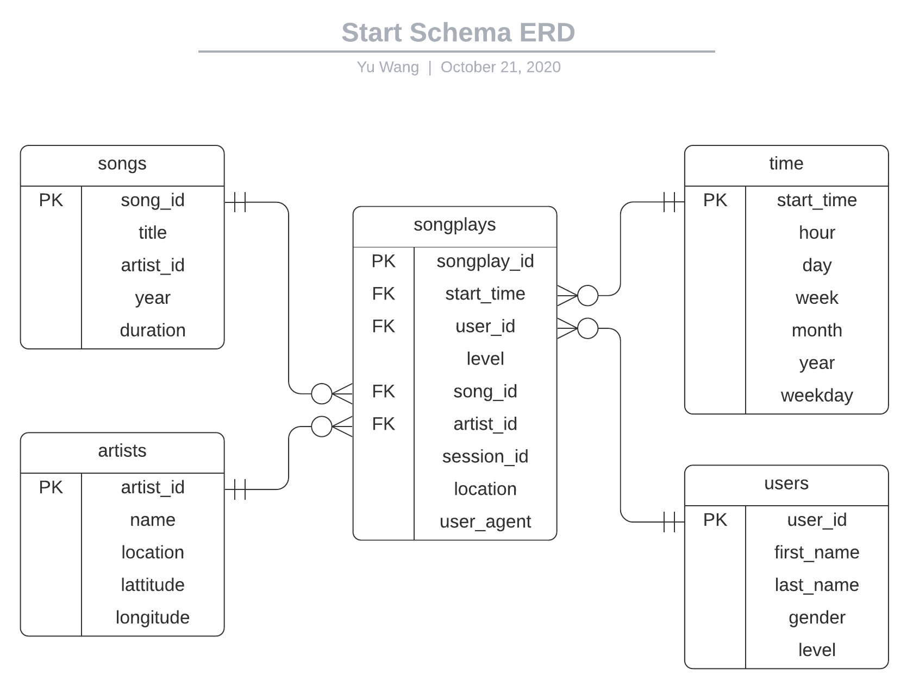

# Data Engineer Nanodegree Subproject
The repository contains the project information of the **Data Warehouse with AWS Redshift** from Udacity Nanodegree 
**[Data Engineer](https://www.udacity.com/course/data-engineer-nanodegree--nd027)**. Please refer to the 
course [website](https://www.udacity.com/course/data-engineer-nanodegree--nd027) for more details. 

Project scenario: A startup called Sparkify has grown their user base and song database and want to move their data process onto 
the cloud. Their data resides in AWS S3 including user activity logs and song metadata in *JSON* format. 

## Business Process / Data Requirements
- Analytics team wants to understand **what songs** their **users** are listening to by analyzing a set of dimensional tables.
- Analytics team wants a **Data warehouse on the cloud** with tables designed to **optimize queries** and gain insights on song plays.

## Engineering Task
- Create and launch a Redshift cluster on AWS 
  - Create a Redshift cluster and IAM role to grant access to S3
- Create a star schema and ETL pipeline to prepare the data for analytics team
  - Explore & load raw data (*JSON*) in S3 to Redshift staging tables
  - Define fact & dimension tables for a star schema for this particular analytic purpose
  - Write an ETL pipeline to load data from staging tables to analytics tables on Redshift
- Connect to the Redshift cluster and run some test queries

## Tools Used
- Python 3
- [AWS](https://aws.amazon.com/)
- [Redshift SQL](https://docs.aws.amazon.com/redshift/latest/dg/welcome.html)
- [Python configparser](https://docs.python.org/3/library/configparser.html)
- [Psycopg2](https://pypi.org/project/psycopg2/)
- [LucidChart](https://www.lucidchart.com/)

## Original Data Sources
**Note** that the actual data (in *JSON*) used in this project is a subset of original dataset preprocessed by the course. The provided data 
resides in AWS S3 (publically available).
1. Song data from [Million Song Dataset](http://millionsongdataset.com/)
2. User activity data from [Event Simulator](https://github.com/Interana/eventsim) based on [Million Song Dataset](http://millionsongdataset.com/)

## Database Schema (Data Warehousing) Design
**User Story**: A **user** plays a **song** whose artist is **artist_name** at time **start_time** using **agent**. 
From the above story, we can extract the necessary information/dimensions:

- **Who**: **users** dimension
- **What**: **songs** and **artists** dimension
- **When**: **time** dimension
- **How (many)**: **songplays** fact
- (More possible dimensions but not used in this project):
	- **Where**: **locations** dimension
	- **How**: **agents** dimension

Since the core business process/metric is an user playing a song, the fact table should store the song play records with 
user/song identifier together with related information about the how and where the song is played. Based on the data and tables 
given in the project, the star schema looks like this (generated using [LucidChart](https://www.lucidchart.com/)):

## ETL Process

## Usage and Sample Results
### Setup & Configuration
1. Setup your IAM user (with programmatic) Access Key and Secret Key with the following commands:
- ``export AWS_ACCESS_KEY_ID=your_access_key_id`` 
- ``export AWS_SECRET_ACCESS_KEY=your_secret_access_key``  
**Note:** You can also setup your Access Key and Secret Key by storing them in config or credential files. 
However we **strongly recommend** the above approach because you won't need to change the codes. 
2. Within the folder ``cluster_start_shutdown/``, there are 2 python scripts and 1 config file for cluster/database parameters:
- ``cluster.cfg``: Defines Redshift cluster Hardware/Database setup and region/role names. You can change them however you want.
- ``start_cluster.py``: All-in-One script to launch the Redshift cluster and handles IAM Role/Policy creation and SecurityGroup configurations.
We **strongly recommend** you to use this script to create the cluster and auto-configure all related resources/services. You **MUST** have a running cluster 
in order to proceed with ETL and query experiments later.
- ``shutdown_cluster.py``: All-in-One script to shutdown the cluster and clean up all related resources for this project. We **strongly recommend** you to run 
this script after you are done with the experiments/project to prevent any further costs induced by AWS Redshift services.

## Implementation Details/Notes
1. About IAM user credentials
Your IAM user should have the following permissions: 
- At least ReadOnly Access to AWS S3: in order to load data from S3 
- FullAccess to AWS Redshift resources: in order to create and manage data warehouse on Redshift clusters
- FullAccess to EC2 resource: in order to create Security Groups for Redshift clusters
- Access to IAM: in order to create IAM roles/policies which will be attached to Redshift cluster  
In this project, we used an IAM user with full access to AWS resources (AdministratorAccess) for simplicity. However, you 
should follow the AWS best practices (to grant least permissions) in real production environment.

## TODOs
1. Analyze table design and performance.

## Resources
1. [Intro to AWS Redshift Cluster Management](https://docs.aws.amazon.com/redshift/latest/mgmt/welcome.html): how to create and manage Redshift clusters on AWS.
2. [Developer guide to AWS Redshift](https://docs.aws.amazon.com/redshift/latest/dg/welcome.html): how to create and develop data warehouses using Redshift.
3. [Python SQL client/driver psycopg2](https://www.psycopg.org/docs/): how to use psycopg2 to connect to SQL PostgreSQL-compatible databases and execute queries.
4. [psycopg2 with Redshift](https://rudderstack.com/blog/access-and-query-your-amazon-redshift-data-using-python-and-r/): how to use psycopg2 to connect to databases on AWS Redshift and execute queries.
5. [Redshift python SDK: boto3](https://boto3.amazonaws.com/v1/documentation/api/latest/index.html)